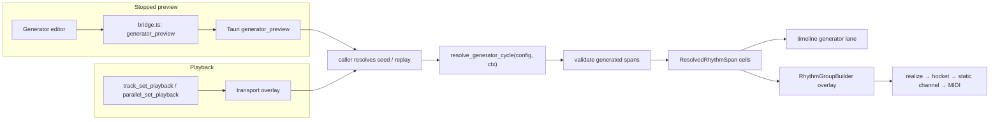

# Adding a Generator

Dum-Ka has one deliberate extension seam: a generator turns deterministic
section spans into play/rest/tie cells. The same Rust resolver feeds stopped
preview and transport playback, so a generator does not get its own preview,
scheduler, or timeline implementation.

The current `Example` generator is the reference implementation. The checklist
below was audited against the commits that introduced it. Complete all 12 touch
points for every new generator; preview wiring and transport are otherwise
kind-agnostic.

## Determinism contract

The following contract is copied verbatim from the extraction plan:

> pure fn of (params, ctx); no wall clock/OS entropy/global state/float nondeterminism; identity-seeded with pinned salts (add/skip/reorder draws never perturbs unrelated decisions); seed resolution is caller's job; must replay byte-identical under seed-path; structural postconditions (cells sorted, non-overlapping, tile `[0, span_len)`, sequential index, cross-span ties only as paired sounding interior handshakes, no first incoming or final outgoing tie); enabled:false ⇒ ledger byte-identical to config that never carried it.

Treat every clause as an API requirement. In particular, do not consume a
single mutable RNG stream in traversal order. Derive each decision from stable
identity, and pin every domain salt in source. `GeneratorConfig` contains only
real generators; `generator_enabled` is the separate bypass and preserves the
selected generator's parameters while disabled.

## Seam



The seam lives in
[`crates/cseq-rhythm/src/generators/mod.rs`](../crates/cseq-rhythm/src/generators/mod.rs).
`GeneratorCycleContext` supplies track identity, cycle, cycle length in beats,
structural spans, a caller-resolved seed, and an automation sampler.
The sampler takes `(target, cycle, authored_default)` and returns `Some(value)`
when an enabled source exists or `None` when the authored value should be used.
The explicit cycle matters for cumulative generators that replay historical
steps while resolving a later cycle.
`track_id` is `None` on the single-track backend. Ordinary parallel tracks,
triggered tracks, and Track Flow sources receive their bare authored track id.
Track Flow's composite `track-flow-<box>:<source>` identity belongs only to
seed-path record/replay; it must never replace the generator context identity.
The running backend kind is pinned at Play, so preview preserves that same
`None`/authored-id choice until Stop. These rules are fenced by `0589d80`.
`CycleGenerator::generate` returns `GeneratedSpan`, an alias retained for the
transport-compatible `ResolvedRhythmSpan`. The exhaustive
`resolve_generator_cycle` dispatch validates both configuration and output.

Stopped preview enters through `generator_preview` in
[`src-tauri/src/main.rs`](../src-tauri/src/main.rs). Playback enters through
`apply_generator_to_tree` in
[`crates/cseq-transport/src/generator.rs`](../crates/cseq-transport/src/generator.rs).
Both call the same resolver. Do not add a generator-specific Tauri command,
transport branch, overlay format, snapshot lane, or scheduler stage.

`ResolvedRhythmCell.velocity` is display metadata stamped by the seam callers
*after* dispatch, never by a generator. Playback inherits each cell's accented
authored leaf inside `append_rhythm_cells`
([`crates/cseq-transport/src/overlay.rs`](../crates/cseq-transport/src/overlay.rs));
stopped preview stamps the same values from the request's optional
`spanVelocities`, which the UI forwards from the structure preview's per-matra
`matraVelocities`. A generator must leave the field `None` and must not read
it: the identity rules above forbid display metadata from feeding decisions,
and both seam callers stamp over the field wherever authored leaves exist, so
nothing a generator writes there can reach the UI reliably.

## Worked example: seeded density

The reference implementation is
[`crates/cseq-rhythm/src/generators/example.rs`](../crates/cseq-rhythm/src/generators/example.rs),
introduced in `beb921b` (`feat: install generic generator seam`). It has two
parameters: `density_percent` and the generic `GeneratorSeedMode`.

For every input span it emits exactly `span_len` cells. Cell `i` starts at `i`,
has length 1, and never ties across a span. At 100% density every cell sounds
and the code takes no random branch; at 0% every cell rests. At intermediate
density, the generator first samples `generator.example.density` through the
context (falling back to the authored parameter), then gives each cell its own
stable stream:

```text
sampled     = ctx.automation("generator.example.density", ctx.cycle, params.density_percent)
density     = clamp(round(sampled.unwrap_or(params.density_percent)), 0, 100)
span_stream = ctx.seed ^ fnv1a64(span_id.to_le_bytes()) ^ EXAMPLE_DENSITY_SALT
draw_rng    = SplitMix64(mix_seed(span_stream, cell_index))
sounds      = draw_rng.next_below(100) < density
```

Consequently, changing or skipping one cell's decision cannot shift another
cell's draw. The module tests pin the 0%, 100%, seed-replay, and seed-change
cases. The shared resolver then checks span identity, sequential indexes,
positive contiguous lengths, exact tiling, and paired cross-span tie handshakes.

The UI side was completed by `2b3c401` (editor), `ab63e68` (density automation
registration), and `419a4fb` (kind-agnostic preview/playback sampling). The
seed-trace label became an exhaustive variant match in `0a2cbc9`. The DTO/e2e
commits are cited below. Use the command `git show <commit> -- <path>` to inspect
each worked change.

## Exact 12-touch-point checklist

### 1. Rust enum variant and validation

Add the serde-tagged variant to `GeneratorConfig` in
`crates/cseq-rhythm/src/generators/mod.rs`. Extend all three exhaustive helpers:
`seed_mode_mut`, `seed_mode`, and `validate`. Put parameter-range validation on
the parameter type and return a specific `GeneratorError`; never clamp invalid
engine input silently. Example proof: `beb921b`.

### 2. Resolver module and unit tests

Add `crates/cseq-rhythm/src/generators/<kind>.rs`, declare the module, and
re-export its parameter type from `generators/mod.rs`. Implement
`CycleGenerator` using only `GeneratorCycleContext`. Test parameter validation,
edge values, deterministic replay, a changed seed, identity stability when an
unrelated decision is added/reordered, exact tiling, and tie handshakes.
Example proof: `beb921b` (`generators/example.rs`) plus `6532c64` and
`05b0db8` for invalid-parameter, identity-stability, tiling/tie, and pinned
64-bit seed-vector regressions.

### 3. Exhaustive dispatch arm

Add one arm to `resolve_generator_cycle` in
`crates/cseq-rhythm/src/generators/mod.rs`. Keep the match exhaustive—do not add
a wildcard or dynamic registry. This compiler-forced arm is the only
per-generator engine dispatch. Example proof: `beb921b`.

### 4. Seed-trace display label

Add an arm to the exhaustive `generator_seed_trace_label` match in
`crates/cseq-transport/src/generator.rs`; `overlay.rs` calls that helper when it
records the `generator` seed trace. The original `"Example Generator"` literal
was introduced by `beb921b` and moved by `3c7472b`, but remained hardcoded.
`0a2cbc9` replaced it with the compiler-enforced match and added the label
regression test. Keep the domain string exactly `generator`; only the human
label varies.

### 5. Invariant strategy and discriminant fence

Extend `generator_config_strategy` in
`crates/cseq-transport/tests/invariants.rs` so fuzzed parallel projects reach
the new variant and its full valid parameter ranges. Extend
`generator_strategy_discriminants_are_exhaustive` with a named arm and expected
set entry. Do not replace the match with `_`; it is the coverage alarm for a
forgotten strategy. Example proof: `e650d56`.

### 6. TypeScript bridge union

Add the parameter interface and tagged union member to `GeneratorConfig` in
`ui/src/bridge.ts`. The serde `kind` spelling must match Rust camelCase exactly.
`GeneratorPreviewRequest`, `TrackPlaybackRequest`, and parallel playback already
carry the union and need no kind-specific command. Add bridge normalization or
wire-shape tests for nontrivial fields. Example proof: `beb921b`.

### 7. Patch v1 type and normalizer arm

Extend `PatchGeneratorConfig` and `normalizePatchGeneratorConfig` in
`ui/src/patchIo.ts`, including defaults, bounds, seed mode, load warnings, and
fixed-point/idempotence tests. A known new kind must survive save/load; a truly
unknown kind must remain disabled with an explicit warning. If the persisted
shape is not backward-compatible, version it deliberately rather than teaching
v1 to guess. Example proof: `beffb04`.

### 8. Editor panel and launcher state

Add kind selection and kind-specific controls in
`ui/src/components/GeneratorEditor.tsx`; update
`ui/src/components/GeneratorEditor.test.tsx` and the generator state/config
assembly plus launcher summary in `ui/src/App.tsx`. Preserve parameters when a
kind or the top-level enable switch is inactive. Use the existing
`playbackStructureLocked` and draft-flush conventions. Example proof:
`2b3c401`.

### 9. Mock Tauri behavior and capture parity

Extend `buildGeneratorPreview` in
`ui/tests/e2e/support/mockTauri.ts` with the new kind's deterministic output.
Keep the generic `generator_preview` and `track_set_playback` command arms and
the `lastGeneratorPreview*` / `lastTrackPlaybackRequest` captures. The command
arms originated in `beb921b`; `6532c64`, `0589d80`, and `05b0db8` pin exact
mock seed math, fail-closed dispatch, preview cache/runtime identity, and
preview-to-playback request equality.

### 10. DTO fixtures in both directions

Exercise the new variant through production assembly in
`ui/src/dtoContract.generate.test.ts` and through Rust serde/validation in the
`dto_fixtures` module of `src-tauri/src/main.rs`. Rust-owned DTOs generate the
typed `ui/src/__fixtures__/dto/*.fixture.ts` files; TypeScript-owned requests
and `patch_document.json` flow back into Rust. Run the fixed order and then the
same commands without update flags:

```bash
. "$HOME/.cargo/env"
UPDATE_DTO_FIXTURES=1 cargo test -p cseq-app dto_fixture
cd ui
pnpm vitest run -u src/dtoContract.generate.test.ts
cd ..
cargo test -p cseq-app dto_fixture
cd ui
pnpm vitest run src/dtoContract.generate.test.ts
```

Review every byte of fixture churn and keep regeneration atomic with its cause.
Example proof: `3745df5` (Rust-to-TS transport DTOs) and `d35a74c`
(TypeScript-to-Rust v1 patch document).

### 11. TypeScript tests and e2e parity smoke

Add focused unit tests for config assembly, persistence, and editor behavior.
In mock e2e, assert the displayed generator request equals the request applied
before Play. In real-backend e2e, prove the backend accepts and resolves the new
tagged DTO; retain MIDI-unavailable skips where transport is required. Do not
weaken the existing timeline/audio source-coherence assertions. Example proof:
`b241909` for the original smoke, strengthened by `6532c64` and `05b0db8` to
compare generator/config/automation/enabled/track identity across single and
parallel playback.

### 12. Optional automation target

If the generator exposes automation, define a stable namespaced target such as
`generator.<kind>.<parameter>` in `ui/src/automationTargets.ts`, add its build
input, tests, and snapshots, and attach the same target to the editor control.
Read that exact string through `ctx.automation` in the Rust module, and verify
the stopped-preview request carries the active `AutomationSet`. Tauri preview
and `crates/cseq-transport/src/generator.rs` must supply equivalent samplers;
the latter receives the same automation through the retained playback config.
Pass the cycle whose start is being sampled, not implicitly the resolver's
final requested cycle. This is especially important for a cumulative fold:
cycle N must sample each historical step 1..=N at that step's own cycle start,
so changing automation at N cannot retroactively rewrite cycles 1..N-1. Treat
`None` as absence of an enabled source; `Some(authored_default)` is still an
active lane and may have different values at earlier cycles.
Declare generator parameters at `cycleStart` unless the resolver actually
samples them at a finer cadence; Example density is sampled once at beat zero
in both callers, and its mock ramp regression proves the value is held for the
cycle.
Target renames are persistence changes. The Example target
`generator.example.density` was registered in `ab63e68`; `419a4fb` completed
and regression-tested its UI → Tauri preview and transport-playback routes.

## Verification

Run these generator-sensitive checks while implementing. Before calling the
generator complete, also run the full local matrix in
[`TESTING.md`](TESTING.md):

```bash
. "$HOME/.cargo/env"
cargo fmt --all -- --check
cargo test -p cseq-rhythm --locked
cargo test -p cseq-transport --features fuzzing --test invariants --locked
cargo test -p cseq-transport --features fuzzing --test golden_ledgers --locked

cd ui
pnpm typecheck
pnpm lint
pnpm test
pnpm test:timeline
pnpm build
pnpm test:e2e
```

Golden changes require an explicit musical explanation. Never use a ledger or
fixture update to hide a preview/playback mismatch. A finished generator has
one resolver, two generic callers, and no generator-specific scheduling code.
