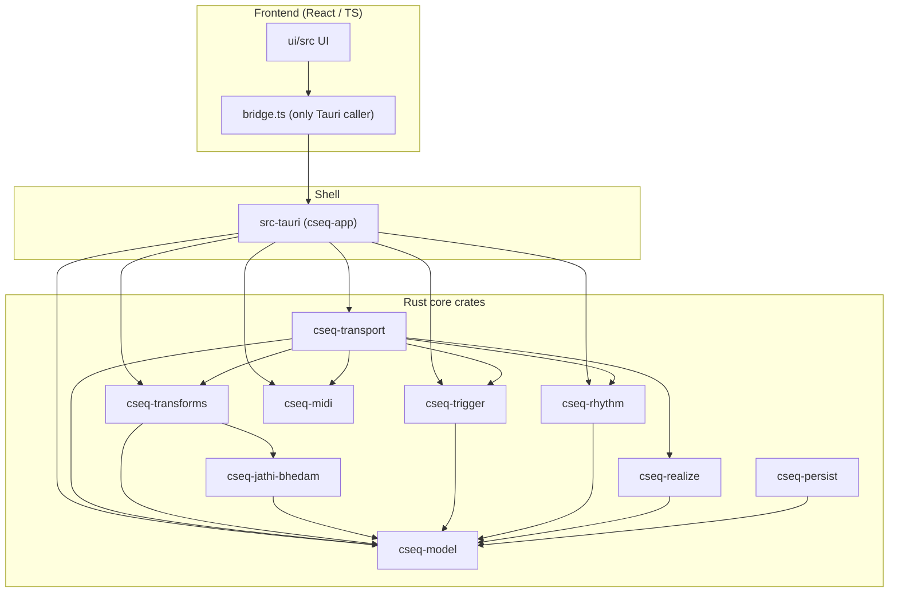
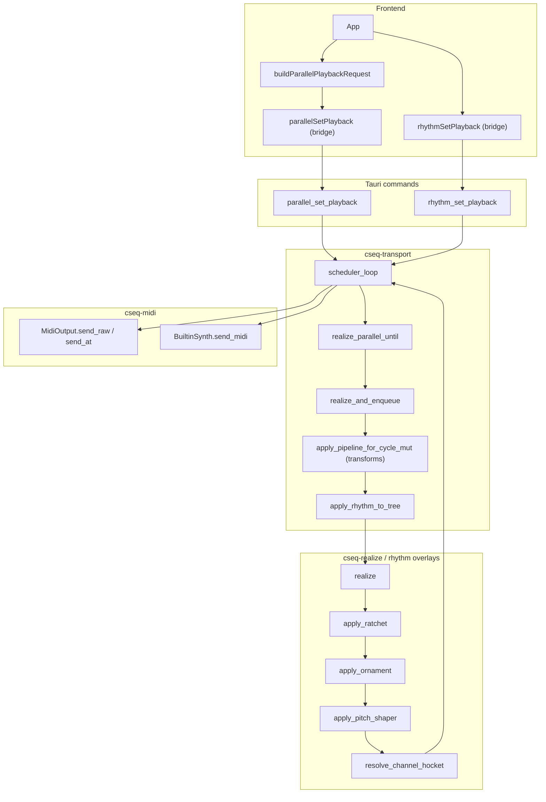
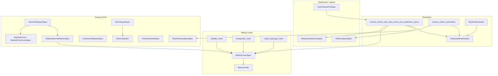
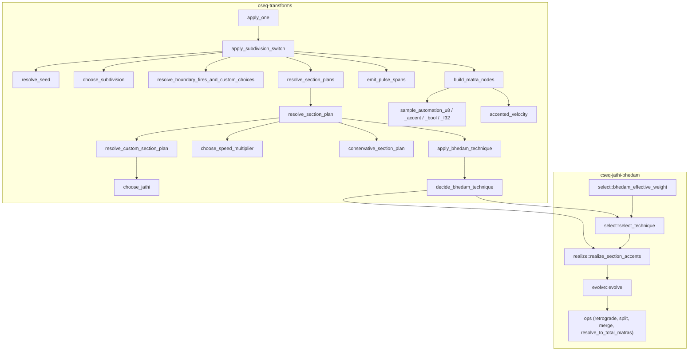
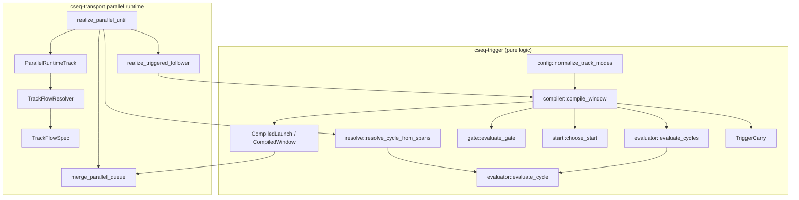
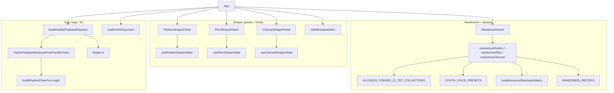
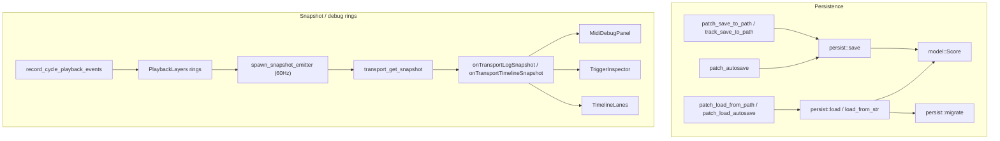

# Caesura Sequencer — Connection Map

Seven scoped Mermaid diagrams showing how the crates, functions, presets, and UI
modules connect. One giant graph would be unreadable, so each subsystem gets its
own diagram. Every node label is a real identifier from the codebase (verified
against source).

---

## 1. Crate dependency graph

Internal path dependencies across the Rust workspace, the Tauri shell, and the
React frontend (arrows point from dependent → dependency). `cseq-model` is the
pure-data root everything builds on; `cseq-transport` is the integrator.

---

## 2. End-to-end request / playback flow

From a React panel edit, through the single Tauri caller, into the per-cycle
realization pipeline, out to CoreMIDI and the built-in synth.

---

## 3. Rhythm engine (`cseq-rhythm`) internals

The Markov resolution entry points plus the overlay spec DTOs that decorate
resolved spans (ratchet, ornament, pitch shaper, channel hocket) and cycle-level
tempo flux. These specs are authored in the UI and consumed by transport.

---

## 4. Transform / SubdivisionSwitch pipeline

`apply_subdivision_switch` orchestrates gati resolution → section boundaries →
jathi choice → conservative modulation → jathi-bhedam realization → span/matra/
accent emission, delegating accent cells to `cseq-jathi-bhedam`.

---

## 5. Triggered tracks + parallel / track-flow runtime

Trigger-graph validation, cycle resolution, and windowed launch compilation
(`evaluate_gate` → `choose_start`), feeding the parallel scheduler and the Track
Flow walker. Everything in `cseq-trigger` is pure/seeded (windowing-associative);
the transport thread consumes its `CompiledLaunch` output.

---

## 6. UI structure

`App` drives the shaper panels (each paired with a state hook), the randomize
workflow with its preset tables, and the pure-logic request/patch builders that
all funnel through `bridge.ts`.

---

## 7. Persistence & snapshot / debug flows

Patch/track/autosave save-load through `cseq-persist` (schema-versioned,
currently v3), and the `PlaybackLayers` telemetry rings captured per cycle and
streamed back to UI debug panels at 60 Hz.

---

## Legend & notes

- **Arrows** mean "depends-on / calls / feeds-into" in the direction drawn;
  type-containment is drawn the same way for readability.
- **Node ids** are alphanumeric; the real symbol names (with `::`, `()`, `/`)
  live inside the quoted labels.
- **Single Tauri boundary:** `ui/src/bridge.ts` is the only frontend module that
  invokes Tauri commands — all UI → Rust traffic passes through it (diagrams 2, 6).
- **Canonical per-cycle pipeline** (diagram 2): `apply_pipeline_for_cycle_mut` →
  rhythm resolution + arbitrary subdivision → articulation overlay → `realize` →
  ratchet → ornament → pitch shaper → channel hocket → optional cycle tempo-flux
  warp → scheduler queue → CoreMIDI + synth. Rewrites are deliberately
  **cycle-local** (already-queued future cycles are never re-ratcheted/re-hocketed).
- **Purity boundary:** `cseq-trigger` and `cseq-jathi-bhedam` are pure/seeded;
  the only async boundary is the transport `scheduler_loop` thread, which consumes
  their `CompiledWindow` / accent outputs.
- **Presets** live entirely in the UI: `HUYGENS_FOKKER_12_TET_COLLECTIONS`
  (tuning/mode collections), `SYNTH_VOICE_PRESETS` (GM voices), and
  `RANDOMIZE_RECIPES` — all fed into `randomize*` and the shaper panels (diagram 6).
  Ratchet **time-curve presets** live in `cseq-rhythm` as `RatchetTimeCurveSpec`
  (diagram 3).
- **Scope:** each diagram shows the load-bearing symbols for one subsystem; leaf
  helpers and secondary data types are elided to keep every graph legible.
